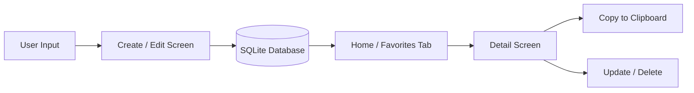
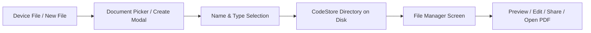

# CodeStore

CodeStore is an offline-first mobile app for developers to store, organize, and manage useful code snippets and files in one place. I built this project while learning React Native to get hands-on experience with local databases, file system operations, multi-screen navigation, and clean mobile UI architecture.

---

## Demo

</img>

---

## Features

### Snippet Management

- **Create & Edit Snippets**: Add code snippets with a title, programming language, comma-separated tags, and the code content.
- **Language Badges & Filtering**: Filter snippets by language (JavaScript, TypeScript, React, React Native, Python) with color-coded language tags.
- **Search**: Real-time search across snippet titles with instant memoized filtering.
- **Favorites**: Star frequently used snippets to access them quickly from a dedicated Favorites tab.
- **Quick Copy**: One-tap copy to clipboard with a 2-second visual confirmation.
- **Snippet Details**: Dedicated view screen showing formatted tags, code preview, language, and quick actions to edit or delete.

### File Management

- **Create Local Code Files**: Create editable files directly in the app supporting `.js`, `.ts`, `.py`, `.html`, `.css`, `.json`, `.md`, and `.txt`.
- **Edit & Preview Files**: View code and text files inside the app with line breaks preserved, or edit file contents on the go.
- **Import from Device**: Pick existing PDF documents or images (`.png`, `.jpg`, `.jpeg`) from your device storage using the system document picker.
- **Custom Naming**: Rename imported files before saving them into the app directory.
- **Dedicated Storage Folder**: All imported and created files are stored in an isolated `CodeStore/` directory inside the app's document path.
- **Metadata Display**: Lists show the file type badge, file size (formatted in B, KB, or MB), and creation timestamp.
- **External PDF Viewing**: Open stored PDF files through Android's default viewer via Intent Launcher.
- **Native Sharing**: Share any stored file with external apps using the native share sheet.

### Local Storage Architecture

- **SQLite (`expo-sqlite`)**: Handles structured data for snippets (titles, languages, code strings, tags, favorite state, timestamps) using SQL queries (`SELECT`, `INSERT`, `UPDATE`, `DELETE`).
- **AsyncStorage (`@react-native-async-storage/async-storage`)**: Saves lightweight persistent preferences, specifically keeping track of the selected light or dark theme across app launches.
- **FileSystem (`expo-file-system`)**: Uses Expo's modern object-oriented `File` and `Directory` APIs to create directories, read file contents, write code edits, copy imported assets from cache, and remove files.

### Theme & Styling

- **Light & Dark Mode**: Full light and dark theme support with custom color tokens.
- **Theme Persistence**: Remembers your theme choice between sessions via AsyncStorage.
- **Custom Typography**: Styled with Google's Plus Jakarta Sans font family across headings, body text, and badges.

### Navigation Structure

- Built with **Expo Router** using file-based routing:
  - **Root Stack**: Manages splash screen, onboarding, and the main home stack.
  - **Native Bottom Tabs**: Home, Favorites, Create, Files, and Settings powered by `expo-router/unstable-native-tabs`.
  - **Modal / Detail Screens**: Snippet details, snippet editor, file preview, and file editor screens open outside the tab bar with smooth transitions.

### User Experience

- **Empty States**: Helpful illustrations and guidance text when search yields no matches, or when the snippet and file libraries are empty.
- **Deletion Safeguards**: Confirmation dialogs before permanently deleting a file or resetting snippet data.
- **Auto Refreshing**: Screens refresh automatically on focus using `useFocusEffect` whenever data changes.

---

## Tech Stack

| Technology                         | Purpose                                                     |
| ---------------------------------- | ----------------------------------------------------------- |
| **React Native**                   | Core mobile application framework                           |
| **Expo** (SDK 55)                  | Development platform and native runtime tools               |
| **TypeScript**                     | Type definitions and tooling support                        |
| **Expo Router**                    | File-based navigation and nested stack/tab routing          |
| **Native Tabs**                    | Platform-native bottom tab bar navigation                   |
| **Expo SQLite**                    | Relational local database for structured snippet storage    |
| **AsyncStorage**                   | Persistent key-value storage for app theme preference       |
| **Expo FileSystem**                | Reading, writing, copying, and organizing local files       |
| **Expo Document Picker**           | Picking files and images from device storage                |
| **Expo Intent Launcher**           | Launching Android's external PDF viewer                     |
| **Expo Sharing**                   | Sharing files via the operating system's native share sheet |
| **Expo Clipboard**                 | Copying code snippets directly to system clipboard          |
| **React Native Safe Area Context** | Handling notches, home bars, and safe margins               |
| **Ionicons (@expo/vector-icons)**  | Consistent icon set across navigation and UI cards          |
| **Plus Jakarta Sans**              | Modern typography via Expo Google Fonts                     |

---

## How It Works

### Snippet Flow



1. You create or edit a snippet in `CreateSnippet` or `EditSnippet`.
2. The data is saved into the local SQLite database (`mydb.db`).
3. `HomeScreen` and `FavoriteScreen` query the database on focus and display snippets as cards.
4. You can search by title, filter by language, toggle favorites, or tap a card to open `DetailSnippet` to copy or modify it.

### File Management Flow



1. You can either create a new code file from `FileModal` or pick an existing file/image via `DocumentPicker`.
2. The file is copied or written directly into the app's `CodeStore/` directory via `expo-file-system`.
3. `FileManagerScreen` reads the directory and calculates file sizes and timestamps.
4. Tapping a file opens `FilePreview`, where you can view text content, preview images, open PDFs in an external viewer, share files, or jump into `EditFile` to update the code.

---

## Project Structure

```text
CodeStore/
├── assets/                  # App icons, splash screens, and images
├── src/
│   ├── app/
│   │   ├── _layout.tsx      # Root stack layout (Theme + Splash + Onboarding)
│   │   ├── SplashScreen.js  # App splash screen
│   │   ├── OnboardingScreen.js # Introduction screen
│   │   └── (home-stack)/
│   │       ├── _layout.tsx  # Stack layout for tabs and detail screens
│   │       ├── DetailSnippet.js # Snippet detail & copy screen
│   │       ├── EditSnippet.js   # Snippet edit modal
│   │       ├── FilePreview.js   # File preview and action screen
│   │       ├── EditFile.js      # Text/code file editor
│   │       └── (main-tabs)/
│   │           ├── _layout.tsx        # Native tabs layout configuration
│   │           ├── HomeScreen.js      # Main snippet list with search & filter
│   │           ├── FavoriteScreen.js  # Starred snippets screen
│   │           ├── CreateSnippet.js   # New snippet creation form
│   │           ├── FileManagerScreen.js # Local file browser & importer
│   │           └── SettingScreen.js   # Dark mode toggle & database reset
│   ├── components/
│   │   ├── DevSnippetsLogo.js # Vector app branding logo
│   │   ├── FileModal.js       # New file creation modal
│   │   ├── ImportModal.js     # Picked file naming & import modal
│   │   └── SplashWaves.js     # Decorative SVG waves for splash
│   ├── constants/
│   │   └── theme.js           # Color palette, font tokens, and useAppFonts
│   ├── context/
│   │   └── ThemeContext.js    # Theme provider and mode switching hook
│   └── store/
│       ├── asyncStore.js      # AsyncStorage helpers for theme settings
│       ├── database.js        # SQLite schema, queries, and CRUD functions
│       └── fileStore.js       # Expo FileSystem, DocumentPicker, & sharing helpers
├── app.json
├── package.json
└── tsconfig.json
```

---

## Getting Started

### Prerequisites

- Node.js (v18 or newer recommended)
- npm or yarn
- Expo Go on your physical Android/iOS device, or an Android Emulator / iOS Simulator

### Installation

1. Clone the repository:

   ```bash
   git clone https://github.com/KrishnaDixit31/codestore-mobile.git
   ```

2. Navigate into the project folder:

   ```bash
   cd CodeStore
   ```

3. Install dependencies:

   ```bash
   npm install
   ```

4. Start the Expo development server:

   ```bash
   npx expo start
   ```

5. Open the app:
   - Press `a` in the terminal for Android emulator.
   - Press `i` for iOS simulator.
   - Scan the QR code using the **Expo Go** app on your physical device.

---

## What I Learned Building This

- **Database operations on mobile**: Setting up tables, running async queries with `expo-sqlite`, managing relationships like tags and favorite flags, and keeping the UI in sync.
- **Handling real files**: Working with device storage directories, dealing with temporary cached files from document pickers, and writing/reading text files directly to disk.
- **Multi-layer navigation**: Combining stack navigators and tab navigators using Expo Router's file-based system without cluttering the screen with unnecessary headers.
- **State persistence**: Understanding the difference between lightweight key-value storage (AsyncStorage) and structured relational storage (SQLite).

---

## Future Improvements

- [ ] **SecureStore Integration**: Add `expo-secure-store` to safely store sensitive developer secrets such as GitHub personal access tokens or API keys.
- [ ] **Code Syntax Highlighting**: Add rich syntax highlighting inside the snippet preview and detail screens.
- [ ] **Export & Backup**: Export snippets into a single JSON backup file and restore them on a new device.
- [ ] **Tags Filter**: Add a multi-tag filter chip system in addition to the language dropdown.
- [ ] **Folder Organization**: Allow organizing snippets into custom folders or collections.

---

## License

This project is licensed under the MIT License. See the [LICENSE](file:///Users/shreekrishnadixit/Desktop/React-Native-Assignments/CodeStore/LICENSE) file for details.
